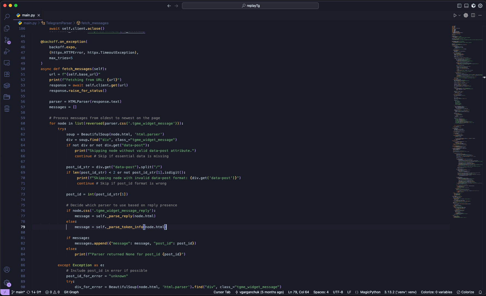

# Quantum Night

Quantum Night theme for VS Code and Cursor with advanced syntax highlighting.

## 🎨 Features

- **Color Palette**: Professional dark palette
- **Syntax Highlighting**: JetBrains-style with detailed configuration
- **Support**: All major programming languages
- **Optimization**: For comfortable work in dark mode
- **Compatibility**: VS Code and Cursor

## 🚀 Installation

### VS Code

1. Open VS Code
2. Press `Ctrl+Shift+X` (or `Cmd+Shift+X` on macOS)
3. Search for "Quantum Night"
4. Click "Install"

### Manual Installation

1. **Download .vsix file** from [Releases](https://github.com/NGdust/quantum-night/releases)
2. **Install via command palette:**
   - `Ctrl+Shift+P` (or `Cmd+Shift+P`)
   - "Extensions: Install from VSIX..."
   - Select downloaded file

## 🎯 Activating the Theme

1. Open VS Code/Cursor
2. Press `Ctrl+Shift+P` (or `Cmd+Shift+P`)
3. Type "Preferences: Color Theme"
4. Select "Quantum Night"

## 🎨 Color Scheme

| Element | Color | Description |
|---------|-------|-------------|
| **Background** | `#1a1b26` | Dark blue |
| **Text** | `#e4f0fb` | Light gray |
| **Keywords** | `#e0957b` | Orange |
| **Strings** | `#62a362` | Green |
| **Functions** | `#c7a65d` | Yellow |
| **Classes** | `#c9c9d1` | Light gray |
| **Comments** | `#565f89` | Gray, italic |

## 📸 Screenshots

### Screenshot

## 📝 Changelog

### 1.1.0
- Update theme description
- Improve color palette
- Update documentation

### 1.0.0
- Initial release
- VS Code and Cursor support
- Professional color scheme
- JetBrains syntax highlighting

## 📄 License

This project is licensed under the MIT License - see the [LICENSE](LICENSE) file for details.

## 🔗 Links

- [GitHub Repository](https://github.com/NGdust/quantum-night)
- [VS Code Marketplace](https://marketplace.visualstudio.com/items?itemName=NGdust.quantum-night)
- [Issues](https://github.com/NGdust/quantum-night/issues)

## ⭐ Support

If you like this theme, give it a star ⭐ on GitHub!
